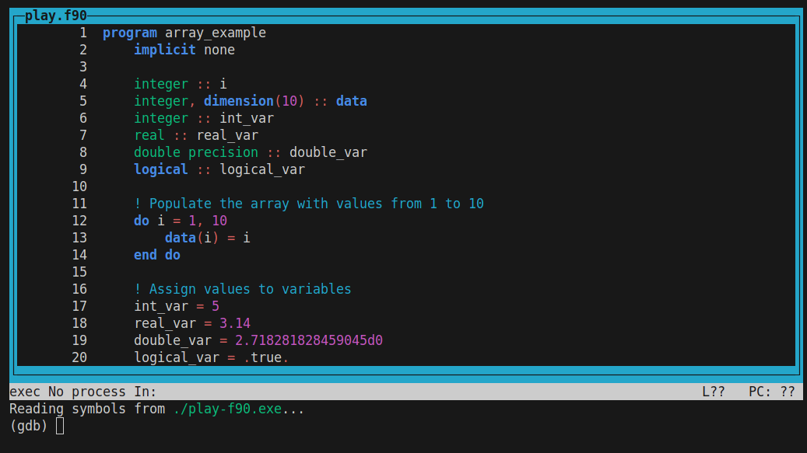

# Play Example

This directory contains a program that can be used as a playground to explore simple `gdb` commands.

The ultimate goal of this example is to learn the essential `gdb` commands we will need to debug
programs in the following examples.

## Lesson Objectives

- [x] how to run `gdb` and start debugging (`start`)
- [x] how to view the Textual User Interface (TUI) (`--tui` or `CTRL-X-A`)
- [x] basic stepping command (`next`)
- [x] how to set/delete breakpoints (`break`, `clear`, `delete`)
- [x] skip commands (`run`, `continue` and `until`)
- [x] stepping into/out of functions/subroutines (`step` and `finish`)
- [x] how to set breakpoints (`break`)
- [x] how to print variables (`print`)

## Building

To build the C++/Fortran versions of the play example, run:

```bash
make
```

This will compile the source files `play.cpp`/`play.f90` and produce the executables `play-*.exe`.

## Debugging

### How to start `gdb`

Type the following command to run the target program (`play-f90.exe`/`play-cpp.exe`) in the debugger
(`gdb`)

```
gdb ./play-f90.exe
```

This should output the following:

```
$ gdb ./play-f90.exe
GNU gdb (Debian 13.1-3) 13.1
Copyright (C) 2023 Free Software Foundation, Inc.
License GPLv3+: GNU GPL version 3 or later <http://gnu.org/licenses/gpl.html>
This is free software: you are free to change and redistribute it.
There is NO WARRANTY, to the extent permitted by law.
Type "show copying" and "show warranty" for details.
This GDB was configured as "x86_64-linux-gnu".
Type "show configuration" for configuration details.
For bug reporting instructions, please see:
<https://www.gnu.org/software/gdb/bugs/>.
Find the GDB manual and other documentation resources online at:
    <http://www.gnu.org/software/gdb/documentation/>.

For help, type "help".
Type "apropos word" to search for commands related to "word"...
Reading symbols from ./play-f90.exe...
(gdb)
```

Currently the debugger is launched but we have not started running our target binary yet
(`play-f90.exe`). To do anything useful in the debugger we will need to start running the target
using the `start` command.

```
(gdb) start
Temporary breakpoint 1 at 0x11e2: file play.f90, line 1.
Starting program: /workspaces/summer-school-debugging/exercises/ex1_play/play-f90.exe 
warning: Error disabling address space randomization: Operation not permitted
[Thread debugging using libthread_db enabled]
Using host libthread_db library "/lib/x86_64-linux-gnu/libthread_db.so.1".

Temporary breakpoint 1, play () at play.f90:1
1       program play
```

Brilliant, from the output we can see a temporary breakpoint has been set at the start of our
program (`Temporary breakpoint 1, play () at play.f90:1`) and that the debugger is currently waiting
on line 1 of our source file `play-f90.exe` waiting to execute line `1       program play`. We will
discuss breakpoints in more detail in the later part of this example. They allow us to instruct the
debugger to pause our target program at specific points.

This our first step to using the debugger. Before we get started properly, it would be good to know
how to exit the debugger as well. This can be done by typing the `quit` command or by pressing the
keyboard shortcut `CTRL-D`.

Whilst it's handy to see `gdb`'s help text the first time we run `gdb`, we will be running it a lot
this course. So let's launch `gdb` with the `-q` quiet flag which will silence the start up message.

```
$ gdb -q ./play-f90.exe
Reading symbols from ./play-f90.exe...
(gdb)
```

### How to view the Textual User Interface

`gdb` is a Command Line Interface (CLI) debugger but it also comes with a built-in Textual User
Interface (TUI). If you have not come across TUIs before they are essentially GUIs (Graphical User
Interfaces) but for the terminal. TUIs are particularly helpful for working on remote systems e.g.,
HPC, because they do not require X11 forwarding. This makes them more responsive and sometimes the
only option if X11 forwarding is disabled/blocked.

To run `gdb` with the TUI we add the following flag `--tui`

```
$ gdb -q --tui ./play-f90.exe
```

This should looks something like the following:



> [!NOTE]
> You can switch between TUI and CLI by pressing `CTRL-X+A`.

For the rest of the course (except the MPI exercise) you can chose to use the CLI or the TUI.

### Basic stepping commands

There are two commands we will learn to progress through the target code. Firstly, we will use
`next`, which effectively runs a single line of source code.

Try this now

```
(gdb) n
12          do i = 1, 10
(gdb) 
```

We can see that we have now moved to line 12. You might wonder why did we skip lines 2-11.
Inspecting the source code below, we can see that none of the lines from 2-11 are executable. The
debugger sees instructions, and therefore it can only stop at, or run executable lines. That means
it will skip comments, variable declarations and other similarly non-executable statements.

```fortran
program play
    implicit none

    integer :: i
    integer, dimension(10) :: data
    integer :: int_var
    real :: real_var
    double precision :: double_var
    logical :: logical_var

    ! Populate the array with values from 1 to 10
    do i = 1, 10
        data(i) = i
    end do
```

Lets run a couple more lines using the `next` command:

> [!NOTE]
> Pressing `Enter` on the keyboard without typing any text into the `gdb` prompt will cause `gdb` to
> re-run the previous command. Try running `next` and then just pressing `Enter` a couple more times
> and see what happens.


```
(gdb) next
13              data(i) = i
(gdb) next
12          do i = 1, 10
(gdb) next
13              data(i) = i
(gdb) next
12          do i = 1, 10
```

It appears that we are _stuck_ in a loop. We could keep running `next`... only 20 or so more times
to get out of the loop, but what if this loop had a thousand iterations, or even a million. We would
be here all day. Lets use breakpoints to _skip_ ahead.

### How to set/delete breakpoints

Breakpoints allow us to set barriers in the code, which will stop the debugger every time it reaches
a specific location. In this course we will consider two types of location:

* function name e.g., `multiply_by_two`
* filename and line number e.g., `play.f90:22`

Both have their uses and you can chose which best suits the behaviour you want. For example, if you
have a function that gets called in multiple places and you want to stop every time, setting a
breakpoint on the function name is the best option. However, lets say that you instead only want to
stop when it is called in a specific part of a specific file. Then the file and line number option
would be best.

For now, we will set a breakpoint at location `play.f90:22`. To do that, we use the `break` command

```
(gdb) b play.f90:22
Breakpoint 2 at 0x622c31c6f23e: file play.f90, line 22.
```

Before we move on, we should also learn how to delete breakpoints. Firstly, we can inspect all set
breakpoints with the `info break` command, e.g.,

```
(gdb) info break
Num     Type           Disp Enb Address            What
1       breakpoint     keep y   0x0000567f25d9f23e in play at play.f90:22
        breakpoint already hit 1 time
```

We can see we only have the 1 breakpoint set at `play.f90:22`. Let's set two more, so that we can
practice deleting them. Run the following commands, `break play.f90:30` and `break play.f90:31`.

```
(gdb) break play.f90:30
Breakpoint 2 at 0x567f25d9f2c0: file play.f90, line 30.
(gdb) break play.f90:31
Breakpoint 3 at 0x567f25d9f3b9: file play.f90, line 31.
```

Checking `info break` again, we now have

```
(gdb) info break
Num     Type           Disp Enb Address            What
1       breakpoint     keep y   0x0000567f25d9f23e in play at play.f90:22
        breakpoint already hit 1 time
2       breakpoint     keep y   0x0000567f25d9f2c0 in play at play.f90:30
3       breakpoint     keep y   0x0000567f25d9f3b9 in play at play.f90:31
```

To delete these breakpoints we have two options

* `clear`
* `delete`

`clear` will take a
[_linespec_](https://sourceware.org/gdb/current/onlinedocs/gdb.html/Linespec-Locations.html) like
the one used to set the breakpoint in the first place i.e., `play.f90:30`. So we can run `clear
play.f90:30` to remove breakpoint 2.

```
(gdb) clear play.f90:30
Deleted breakpoint 2 
```

`delete` take a breakpoint number e.g., 3 and it will delete in this case the breakpoint set at
`play.f90:31`.

```
(gdb) delete 3
(gdb) info break
Num     Type           Disp Enb Address            What
1       breakpoint     keep y   0x0000567f25d9f23e in play at play.f90:22
        breakpoint already hit 1 time
```

We are now back to where we started, left with just breakpoint 1 at `play.f90:22`.

In the next section we will see how we can continue running the debugger up until that breakpoint.

### Skip commands

As we have seen in the previous sections, running `next` and stepping through individual lines can
be useful, but if we have a loop or lots of code to skip through, we want a better solution. For
that we have a range of commands at our disposal.

* `run`
* `continue`
* `advance`

`run` will start program execution (if it hasn't been started already) and run the code until it
either completes successfully, hits a bug and crashes, or hits a breakpoint. If the code is already
running, it will ask you if you want to start the program from the beginning. This can be helpful,
when you have gone past a point of interest in the code, and you want to start from the beginning
again.

`continue` is like `run` but it assumes the program has already been started. Similarly, it will
continue program execution until it either completes successfully, hits a bug and crashes, or hits a
breakpoint.

Let's use `continue` to run our program out of the loop until we reach our previously set
breakpoint.

```
(gdb) continue
Continuing.

Breakpoint 2, play () at play.f90:22
22          call multiply_by_two(int_var)
```

This should take us to line 22 as specified earlier.

`advance` is a bit like continue, but it also sets a temporary breakpoint. So for example, instead
of setting the breakpoint in the previous section, we could have just said `advance play.f90:22` and
it would have set a one-time breakpoint at that location, continued until it reaches and then
deleted the breakpoint. This can be handy if you are exploring and don't want to set permanent
breakpoints.

### Stepping into functions/subroutines

We are currently on line 22 of our program

```
22          call multiply_by_two(int_var)
```

If we were to run the `next` command, we would run the line, which internally would involve the
program calling subroutine `multiply_by_two`, running the code in that function and returning. But
what if we want to inspect what happens inside of this function. We have a couple of options:

* Set a breakpoint inside the function so that the debugger is forced to stop inside, or
* Step into the function using the `step` command

Whilst the first option is valid, it requires more work in this case. So let's take advantage of the
`step` command.

```
(gdb) step
play::multiply_by_two (var=5) at play.f90:41
41              var = 2 * var
```

We are now inside the `multiply_by_two` subroutine, on line 41. From here we can explore the
internals of this subroutine if we wish.

If we want to return from this function, we can run the `finish` command. This will execute this
function and return back to the previous stack frame. It also prints the return value of this
function (if there is one).

```
(gdb) finish
Run till exit from #0  play::multiply_by_two (var=10) at play.f90:42
play () at play.f90:25
25          if (logical_var) then
```

We are now back in the main body of the code, on line 25.

### How to print variables

One of the most helpful feature of debuggers is the ability to print values held in memory. Let's
say this is a large code, and we have no idea where `logical_var` was set. And we don't know what
it's value is at run-time (perhaps it depends on the result of a complex calculation). We can use
the debugger to print its value, using the `print` command. The syntax is `print <varname>`, e.g.,
`print logical_var`. Try this now

```
(gdb) print logical_var 
$1 = .TRUE.
```

Brilliant, so we now know the value is true, meaning that the next statement (`if (logical_var)
then`) will execute and proceed to line 26.

> [!NOTE]
> Debuggers are extremely powerful, and in this tutorial we unfortunately only have time to scratch
> the surface. Debuggers can inspect/print memory even when the program itself may not _allow_ it
> e.g., you can print member variables of classes even if they are private

### Putting it all together

The idea of this exercise, is that you can are now ready to explore on your own. Exit this debugging
session using the `quit` command. Start a new session and try to do the following:

- [ ] Set a breakpoint on line 17 of `play.f90` (or line 21 of `play.cpp`)
- [ ] Print the value of `int_var` before and after executing that line, what do you notice?
- [ ] Do the same for the remaining variables
- [ ] After setting a breakpoint, restart the debugging session with the `run` command, what do you notice?
- [ ] Try using the `advance` command to skip sections of the code. Can you use `advance` to stop
      execution inside of the `multiply_by_two` subroutine/function?
