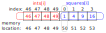

# Memory Example

This exercise demonstrates memory management issues in both C++ and Fortran. The main goal is to
illustrate debugging techniques for memory-related bugs, such as buffer overflows or invalid memory
access, using `gdb`.

We will learn how to use the `watch` command to track invalid memory read/writes which will help us
identify the source of our buffer overflow.

Buffer overflows can be very difficult to detect as they don't typically generate compiler errors
and they often don't trigger runtime errors either! Even worse, programs with buffer overflows can
appear to run correctly, but they subtly modify the programs state with unintended consequences.

Memory bugs often depend on the environment they are run in, e.g., the compiler used, the system
architecture, compiler flags used and so on. So for this example, in order to get a "*consistent*"
memory bug that always occurs I had to use a rather contrived example. This is because I wanted to
guarantee that the memory I corrupt is in a specific part of my program. However, it's important to
note that memory errors can occur in C++/Fortran codes even if the memory isn't allocated in this
specific way.

## Lesson Objectives

- [x] use `up`/`down` to move between stack frames
- [x] use `watch` command to detect memory bugs

## Building

To build the C++/Fortran versions of the memory example, run:

```bash
make
```

This will compile the source files `sums.cpp`/`sums.f90` and produce the executables
`sums-cpp.exe`/`sums-f90.exe` respectively.

## Debugging

Both codes perform summation operations on two arrays, one to compute the sum of integers from 1 to
50, and the other to compute the sum of its squares. If we run the executable we get the following:

```bash
$ ./sums-cpp.exe
sum of integers from 1 to 50 is :: 1275
Error :: sum of the squares of integers from 1 to 50 is wrong.
```

It seems that our program has detected there is some kind of issue. For some reason the sum of
squares is incorrect. So how should we start debugging this scenario.

### Initial investigation

One approach is to set a breakpoint at the site of the problem, and then work our way backwards.

I will show the commands for the C++ version but this applies just as equally to the Fortran
example.

First we will start our program in the `gdb` debugger

```
$ gdb -q sums-cpp.exe
Reading symbols from sums-cpp.exe...
(gdb) start
Temporary breakpoint 1 at 0x1194: file sums.cpp, line 13.
Starting program: /workspaces/summer-school-debugging/exercises/ex3_memory/sums-cpp.exe 
warning: Error disabling address space randomization: Operation not permitted
[Thread debugging using libthread_db enabled]
Using host libthread_db library "/lib/x86_64-linux-gnu/libthread_db.so.1".

Temporary breakpoint 1, main () at sums.cpp:13
13        int big_array[2 * N] = {0};
(gdb)
```

Recall that our code failed with error saying the sum of squares is wrong. That print statement
occurs on line 62, in function `validate_square_sum`. Let's set a breakpoint (`break`) here and
start our investigation.

```
$ (gdb) break validate_square_sum
Breakpoint 2 at 0x60c408678376: file sums.cpp, line 57.
```

Now we can `continue` the binary and we will stop when we reach the breakpoint.

```
(gdb) continue
Continuing.
sum of integers from 1 to 50 is :: 1275

Breakpoint 2, validate_square_sum (sum=42975) at sums.cpp:57
57        if (sum == (N * (N + 1) * (2 * N + 1)) / 6) {
(`gdb`)
```

### Navigating the stack

`gdb`'s print command can print variables as we have seen before e.g., `print sum` but it can also
print expressions. Lets print both sides of the equivalence statement

```
(gdb) p sum
$1 = 42975
(gdb) p (N * (N + 1) * (2 * N + 1)) / 6
$2 = 42925
```

We can see that indeed `sum` (=42975) does not equal `(N * (N + 1) * (2 * N + 1)) / 6` (=42925). For
some reason our sum is 50 larger than it should be, but we still don't know why.

We can use `backtrace` to see our current position in the stack frame. This will essentially show us
a history of where we have come from, which functions were called to lead us to where we are now.

```
(gdb) backtrace
#0  validate_square_sum (sum=42975) at sums.cpp:57
#1  0x00005fbfbf037260 in compute_sums (array_ints=0x7ffe72900af0, 
    array_squares=0x7ffe72900bb8) at sums.cpp:32
#2  0x00005fbfbf0371ca in main () at sums.cpp:15
```

We can see that we are currently in `validate_square_sum` on line 57. And this function was called
by `compute_sums` on line 32, which was in turn called by `main` on line 15. Take a moment to
inspect the source code and you can verify for yourself that this looks correct.

One of the many great things about debuggers, and in this case, `gdb` is that it allows us to
traverse the stack frame and inspect the context that lead to our current state. To traverse the
stack frame there are three commands we will use

* `frame`/`frame <n>` where `<n>` is a frame number
* `up`
* `down`

`frame` on its own will display the current frame, so that we can remind ourselves where we are.
`frame <n>` allows us to jump to a specific frame number e.g., if you inspect the previous
`backtrace` command we can see that there are 3 frames; 0, 1 and 2. `frame 2` would take us to `main
() at sums.cpp:15`. `up` moves up one stack frame and `down` moves back down.

Lets go up one stack frame using `up` and inspect the context of the previous stack frame.

```
(gdb) up
#1  0x00005fbfbf037260 in compute_sums (array_ints=0x7ffe72900af0,
    array_squares=0x7ffe72900bb8) at sums.cpp:32
(gdb)
```

The source code for this function is as follows:

```cpp
void compute_sums(int *array_ints, int *array_squares) {
  int sum1 = 0, sum2 = 0;

  initialize_squares(array_squares);
  initialize_ints(array_ints);

  for (int i = 0; i < N; ++i) {
    sum1 += array_ints[i];
    sum2 += array_squares[i];
  }

  validate_sum(sum1);
  validate_square_sum(sum2);
}
```

`sum2` is the problematic value and that gets computed on line 32 (`sum2 += array_squares[i];`).
Let's print out the values in our array. Maybe there's a problem with the inputs. To print
array-like objects in `gdb` we will use the following syntax `print array[start_idx]@N` where
`array` is the name of the array-like object, `start_idx` is the starting index/location we want to
inspect (usually the first index) and `N` is the number of elements we want to print.

> [!NOTE]
> `gdb` will not do any bounds checking on the array. If we print memory out of scope of our array
> `gdb` has no idea and will just display what ever is next in memory. This can be useful but also
> confusing if you are not expecting it.

```
(gdb) print array_squares[0]@50
$3 = {51, 4, 9, 16, 25, 36, 49, 64, 81, 100, 121, 144, 169, 196, 225, 256, 289, 324, 361,
  400, 441, 484, 529, 576, 625, 676, 729, 784, 841, 900, 961, 1024, 1089, 1156, 1225, 1296,
  1369, 1444, 1521, 1600, 1681, 1764, 1849, 1936, 2025, 2116, 2209, 2304, 2401, 2500}
(gdb)
```

Aha! This looks might suspicious. The first element of our array `array_squares[0]` is 51 but it
should be 1 (see source code line 42-44). `51-1=50`, which is exactly the difference we found
earlier. It would appear that at some point in our program, this array is being overwritten. How can
we track this down?

### `watch`ing memory

We can use `gdb`'s `watch` command to inform us every time a piece of memory is either read-from, or
written-to. This will help us track down the point at which our data is corrupted.

Let's restart our debugging session (by quitting and launching `gdb` again). And this time we will
first stop at `compute_sums` where our array is initialized.

```
$ gdb -q sums-cpp.exe
Reading symbols from sums-cpp.exe...
(gdb) start
Temporary breakpoint 1 at 0x1194: file sums.cpp, line 13.
Starting program: /workspaces/summer-school-debugging/exercises/ex3_memory/sums-cpp.exe 
warning: Error disabling address space randomization: Operation not permitted
[Thread debugging using libthread_db enabled]
Using host libthread_db library "/lib/x86_64-linux-gnu/libthread_db.so.1".

Temporary breakpoint 1, main () at sums.cpp:13
13        int big_array[2 * N] = {0};
(gdb) advance compute_sums
compute_sums (array_ints=0x7ffed10c1700, array_squares=0x7ffed10c17c8) at sums.cpp:21
21        int sum1 = 0, sum2 = 0;
(gdb) 
```

Now, we will set a watchpoint on our array `array_squares`, specifically the first element
`array_squares[0]`.

```
(gdb) watch array_squares[0]
Hardware watchpoint 2: array_squares[0]
```

watchpoints are a bit like breakpoints in that we can continue code execution, but now `gdb` will
pause every time our memory is written-to or read-from. So lets run `continue`.

```
(gdb) continue
Continuing.

Hardware watchpoint 2: array_squares[0]

Old value = 0
New value = 1
initialize_squares (arr=0x7ffed10c17c8) at sums.cpp:42
42        for (int i = 0; i < N; ++i) {
```

From the output we can see that `gdb` has detected our memory change from `Old value = 0` to `New
value = 1` and this occurred on line 42 inside the `initialize_squares` function. This is the loop
where we initialize our array. So this is expected. Lets keep going...

```
(gdb) continue
Continuing.

Hardware watchpoint 2: array_squares[0]

Old value = 1
New value = 51
initialize_ints (arr=0x7ffed10c1700) at sums.cpp:36
36        for (int i = 0; i <= N; ++i) {
```

Huh, this time it also stopped in function `initialize_ints` on line 36. This is not what we expect.
Printing the value of `i` gives 50.

```
(gdb) print i
$2 = 50
```

This is a problem. In C++ arrays of length N run from 0 to N-1. It appears as though we are trying
to set the 51st element i.e., `arr[50]` when the last element in that array is actually `arr[49]`.
This example was deliberately created in such a way that the two arrays we are working with
`array_ints` and `array_squares` are contiguous in memory -- meaning that they immediately follow
one another. The figure below demonstrates the issue. We are writing to memory location 50 which is
actually `array_squares[0]`.



This is a classic mistake, and we can fix it by changing the range of our loop in `initialize_ints`
from this

```cpp
for (int i = 0; i <= N; ++i) {
```

To this

```cpp
for (int i = 0; i < N; ++i) {
```

Lets recompile and see if our program will now run successfully.

```
$ make
g++ -g -O0 -Wall -fno-omit-frame-pointer sums.cpp -o sums-cpp.exe
@TomMelt ➜ /workspaces/summer-school-debugging/exercises/ex3_memory (main) $ ./sums-cpp.exe 
sum of integers from 1 to 50 is :: 1275
sum of the squares of integers from 1 to 50 is :: 42925
```

Hooray! :tada: The program is now running successfully.

### Putting it all together

- [ ] play around on the stack, use combinations of `up`, `down` and `frame` to navigate the
  stack frame
- [ ] what can you see in each stack frame (try `info locals`, `info args`)
- [ ] go back to exercise 1 and see if you can set a watchpoint on `int_var`

> [!NOTE]
> One interesting point of this exercise is it helps us to track down a memory error that even
> `valgrind` and memory sanitizers won't detect. For some use cases a debugger may be your only
> option.
