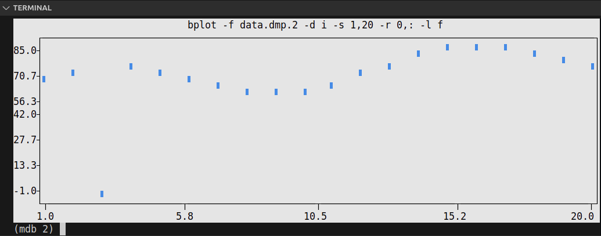

# MPI Example

This exercise is based on a fake analysis code that uses MPI to process some mock data. Whilst this
example is made up, it is not too far from a realistic analysis code. We will use this example to
learn how `mdb` can be used to debug MPI programs.

`mdb` provides a generic front-end for multiple backend debuggers e.g., `gdb`, `lldb`, `cuda-gdb`
and many others. We will use the `gdb` backend (which is the default choice) to build upon our
knowledge from the previous exercises.

We will see later that almost everything we have already learned can be almost immediately applied
in `mdb`.

The **main** thing you need to learn is how to switch from a serial-program mindset, to a
parallel-program mindset. That is, when debugging MPI programs, you need to think in MPI. Hopefully
the exercises below will make this clear.

> [!NOTE]
> When debugging MPI programs it is relatively easy to end up in infinite loops e.g., waiting for
> processes to reach a breakpoint they can never reach, or leaving some processes blocked at
> `MPI_Barrier`s. Part of MPI debugging is learning to keep these kinds of situations in our minds,
> so that we can better use the debugger.

## Lesson Objectives

- [x] think in parallel when debugging MPI programs
- [x] `launch` and `attach` the `mdb` debugger
- [x] learn how to get help with `mdb`
- [x] issue debug commands to the debugger backend using `command`
- [x] `select` which ranks you want to debug
- [x] use `broadcast` mode to interact directly with the backend
- [x] debug hanging programs using `backtrace`
- [x] `dump` memory from each process for post-processing
- [x] issue `shell` commands from `mdb`
- [x] script `mdb` debugging sessions

## Building

To build the C++/Fortran versions of the memory example, run:

```bash
make
```

This will compile the source files `analysis.cpp`/`analysis.f90` and produce the executables
`analysis-cpp.exe`/`analysis-f90.exe` respectively.

## Debugging

In this example I will focus on the Fortran example, but both codes are functionally the same. The
analysis code generates some fake data on each rank (in practice this would be read from a file).

```fortran
    ! generate fake input data (this would have been read from file normally)
    input_data = (/(rank * array_len + i, i = 1, array_len)/)
```

This data will then be processed on each rank separately

```fortran
    ! process data on each rank
    call process_partial_data(input_data)
```

Once it has been processed it will be gathered into a single array large enough to hold all of the
data `analysed_data`, assuming it passes a data integrity check (`data_integrity_check`).

```fortran
    ! only gather the data if it passes the integrity check
    call data_integrity_check(input_data, check)
    if (check > 0) then
      call MPI_Gather(input_data, array_len, MPI_INTEGER, analysed_data, array_len, MPI_INTEGER, 0, MPI_COMM_WORLD, ierr)
    end if
```

Lastly, we run a final processing stage on the full data `process_full_data` which only gets run on
rank 0.

```fortran
      call process_full_data(analysed_data)
```

Now we have an understanding of the code, lets try running it:

```bash
$ mpirun -n 4 ./analysis-f90.exe
```

> [!NOTE]
> This code is designed specifically to run on 4 processes, so it will only work when run with
> `mpirun -n 4`.

This will give something like the following

> [!NOTE]
> The order of the output will most likely be different to the one below. In general, MPI processes
> can run in any order and therefore the first one to write output can vary from run to run. Try
> running it a couple of times and see what happens.

```bash
$ mpirun -n 4 ./analysis-f90.exe
Process 3 input_data:  61,  62,  63,  64,  65,  66,  67,  68,  69,  70,  71,  72,  73,  74,  75, 76,  77,  78,  79,  80,
gathering data...
Process 0 input_data:   1,   2,   3,   4,   5,   6,   7,   8,   9,  10,  11,  12,  13,  14,  15, 16,  17,  18,  19,  20,
gathering data...
Process 1 input_data:  21,  22,  23,  24,  25,  26,  27,  28,  29,  30,  31,  32,  33,  34,  35, 36,  37,  38,  39,  40,
gathering data...
Process 2 input_data:  41,  42,  43,  44,  45,  46,  47,  48,  49,  50,  51,  52,  53,  54,  55, 56,  57,  58,  59,  60,
gathering data...
```

But then it appears to hang forever. Because this code is relatively small we would expect it to
execute almost immediately. So it appears there is something wrong. Let's use `mdb` to investigate
further. On your keyboard press `CTRL+C` in the terminal to terminate the `mpirun` command.


### Initial investigation

For a more detailed rundown of how `mdb` works, please see the tutorial in `mdb`'s
[documentation](https://mdb.readthedocs.io/en/latest/quick-start.html). We will cover the essential
instructions here.

### `launch`ing and `attach`ing `mdb`

`mdb` has a two stage run process. This is because it is designed to operate on HPC where we
typically run our job on a compute node, but then connect to it from a login node. However, it also
works perfectly find when run on the same machine, which is what we will do here. There are
different ways to do this, but I find the easiest is to split the terminal. You can split the Visual
Studio Code terminal by clicking the split terminal button, or using the keyboard shortcut
`CTRL+SHIFT+5`.

In one terminal (doesn't matter which) type the `launch` command. You should see the following

```bash
$ mdb launch -n 4 -t analysis-f90.exe -p 3000
running on host: 127.0.0.1
to connect to the debugger run:
mdb attach -h 127.0.0.1 -p 3000

connecting to debuggers ... (4/4)
all debug clients connected
```

`mdb launch` does two main things:

1. start `-n` instances of the target program `-t `, which in this case is `analysis-f90.exe`. Each
   instance is wrapped with a debug client that runs the target program in a backend debugger (the
   default is `gdb`)
2. start the `mdb` exchange server which handles communication between the user's input and the
   backend debuggers (in this case `gdb`)

> [!NOTE]
> In our `mdb` launch command we passed the flag `-p 3000`. This tells `mdb` to run on port 3000.
> The default for `mdb` is 2000 but this conflicts with the default port used by codespaces. So we
> will change it to 3000 for these exercises.

To interact with `mdb` we now need to `attach` to `mdb`. Type the following command in the other
terminal split (or a separate terminal if you prefer).

```bash
mdb attach -h 127.0.0.1 -p 3000
```

`-h/--hostname` is the host IP address of the machine where `mdb launch` was run. `-p/--port` is the
port that `mdb` is using. You might wonder, how are you supposed to know the host IP address. Well,
whilst there are different ways to get this information, `mdb launch` kindly outputs it for us as
shown in the previous output

```bash
to connect to the debugger run:
mdb attach -h 127.0.0.1 -p 3000
```

The output should of `mdb attach` should look like the following

```
$ mdb attach -h 127.0.0.1 -p 3000
mdb - mpi debugger - built on various backends. Type ? for more info. To exit interactive mode type
"q", "quit", "Ctrl+D" or "Ctrl+]".
(mdb 0-3) 
```

We are now connected to the debugger and we are nearly ready to start debugging. First, take note of
the output

```
Type ? for more info. To exit interactive mode type "q", "quit", "Ctrl+D" or "Ctrl+]".
```

We will take a look at the help functionality of `mdb` in the next section. To quit `mdb`, I usually
press the keyboard shortcut `CTRL+D` (though this may not work in the browser). If so, type
`quit`/`q` and press enter.

### Getting help

`mdb` has a variety of ways to get help:

* [official documentation](https://mdb.readthedocs.io/en/latest/)
* CLI help e.g., `mdb attach --help` or `mdb launch --help` to get a list of CLI options
* In `mdb`'s REPL (Read-Eval-Print Loop) -- type `?` or `help`
* There are also `man` pages (but these need to be built and installed)

As we are currently connected to `mdb` and we are in `mdb`'s REPL, let's try typing `?`. This is
equivalent to typing `help`. It will show you available `mdb` commands.

```
(mdb 0-3) help

Documented commands (type help <topic>):
========================================
broadcast  command  dump  execute  help  plot  quit  select  shell
```

We can now learn more about any of `mdb`'s commands using the syntax `help <topic>` where `<topic>`
is one of the above options e.g., `help command`.

### Using the "`command`" command

Let's get back to debugging. We have `attach`ed to `mdb` and we are now ready to start issuing
commands to our MPI processes. `mdb` is designed around the manipulation of multiple processes. In
order to issue commands to each debug process, we need to tell `mdb` to run that command. This is
done using a command called... `command`. Let's use `mdb`'s help to see how it works. Type `help
command`

```
(mdb 0-3) help command
Description:
Run [command] on every selected process. Alternatively, manually
specify which ranks to run the command on.

Example:
The following command will run "print myvar" command on every process.

    (mdb) command print myvar

The following command will run "print myvar" command on processes 0,3,4 and 5.

    (mdb) command 0,3-5 print myvar
```

So, if we type `command info proc` `mdb` will run `info proc` on each rank/process individually,
gather the result and display it to us in the terminal. Note that the `mdb` prompt is `(mdb 0-3)`,
in this specific example. This tells us that any commands issued via `command` will be sent to
processors `0-3`. For example,

```
(mdb 0-3) command info proc
0:      process 15706
0:      cmdline = '/workspaces/summer-school-debugging/exercises/ex4_mpi/analysis-f90.exe'
0:      cwd = '/workspaces/summer-school-debugging/exercises/ex4_mpi'
0:      exe = '/workspaces/summer-school-debugging/exercises/ex4_mpi/analysis-f90.exe'
************************************************************************
1:      process 15707
1:      cmdline = '/workspaces/summer-school-debugging/exercises/ex4_mpi/analysis-f90.exe'
1:      cwd = '/workspaces/summer-school-debugging/exercises/ex4_mpi'
1:      exe = '/workspaces/summer-school-debugging/exercises/ex4_mpi/analysis-f90.exe'
************************************************************************
2:      process 15703
2:      cmdline = '/workspaces/summer-school-debugging/exercises/ex4_mpi/analysis-f90.exe'
2:      cwd = '/workspaces/summer-school-debugging/exercises/ex4_mpi'
2:      exe = '/workspaces/summer-school-debugging/exercises/ex4_mpi/analysis-f90.exe'
************************************************************************
3:      process 15712
3:      cmdline = '/workspaces/summer-school-debugging/exercises/ex4_mpi/analysis-f90.exe'
3:      cwd = '/workspaces/summer-school-debugging/exercises/ex4_mpi'
3:      exe = '/workspaces/summer-school-debugging/exercises/ex4_mpi/analysis-f90.exe'
```

`command` is used to send commands directly to the `gdb` instance of each processor. In this case I
sent `info proc` which prints information on each process. The output is sorted in numerical order
with each process having it's own rank id prepended to the output in the format `[rank id]:`. Each
rank's output is separated by a dividing line of asterisk characters i.e., `***`. If you want to
issue a `gdb` command to a specific rank (or set of ranks) only then you can provide an optional set
of ranks, either comma-separated, hyphen-separated or a mix of both. For example, to send command
`info proc` to ranks 1 and 3 only use the following

```
(mdb 0-3) command 1,3 info proc
1:      process 15707
1:      cmdline = '/workspaces/summer-school-debugging/exercises/ex4_mpi/analysis-f90.exe'
1:      cwd = '/workspaces/summer-school-debugging/exercises/ex4_mpi'
1:      exe = '/workspaces/summer-school-debugging/exercises/ex4_mpi/analysis-f90.exe'
************************************************************************
3:      process 15712
3:      cmdline = '/workspaces/summer-school-debugging/exercises/ex4_mpi/analysis-f90.exe'
3:      cwd = '/workspaces/summer-school-debugging/exercises/ex4_mpi'
3:      exe = '/workspaces/summer-school-debugging/exercises/ex4_mpi/analysis-f90.exe'
```

> [!NOTE]
> You can use comma and hyphen separated lists e.g., if you had 12 MPI ranks you could use the
> following list `0,3,5-8,11` to run a command on ranks 0,3,5,6,7,8 and 11.

### `select`ing ranks

`command` is great for issuing commands to all ranks (or those manually specified). What if, we want
the default behaviour of `command` to be something other than all ranks though. This is where
`select` comes in handy. We can `select` which ranks become the default. Let's say we only care
about ranks 0 and 2, then we can use `select 0,2` and we should get the following

```
(mdb 0-3) select 0,2
(mdb 0,2) 
```

Notice that the prompt has also changed from `(mdb 0-3)` to `(mdb 0,2)`. So now, if we re-run our
previous command, `command info proc` we now get the following

```
(mdb 0,2) command info proc
0:      process 1573
0:      cmdline = '/workspaces/summer-school-debugging/exercises/ex4_mpi/analysis-f90.exe'
0:      cwd = '/workspaces/summer-school-debugging/exercises/ex4_mpi'
0:      exe = '/workspaces/summer-school-debugging/exercises/ex4_mpi/analysis-f90.exe'
************************************************************************
2:      process 1571
2:      cmdline = '/workspaces/summer-school-debugging/exercises/ex4_mpi/analysis-f90.exe'
2:      cwd = '/workspaces/summer-school-debugging/exercises/ex4_mpi'
2:      exe = '/workspaces/summer-school-debugging/exercises/ex4_mpi/analysis-f90.exe'
```

Have a play trying different combinations e.g., 0,1,2,3 is equivalent to 0-3. Once you have finished
playing, set select back to all ranks (either by using `select 0-3` or you can just type `select`
and it will default back all ranks).

```
(mdb 0,2) select
(mdb 0-3)
```

### `broadcast` mode

Whilst the `command` command is pretty useful. For long debugging sessions it can be annoying
constantly prefixing `command` to every `gdb` command you want to run. This is where broadcast
mode comes in handy. In broadcast mode all commands will be automatically prefixed with `command`
so that they run on the selected ranks. By default all ranks are selected unless you have manually
specified a different selection with the `select` command.

To enter broadcast mode type the following,

```
(mdb 0-3) broadcast start
(bcm 0-3)
```

The command prompt will turn to `(bcm 0-3)`. To leave broadcast mode either press `CTRL+D` or type
`quit`/`broadcast stop`, e.g.,

```
(bcm 0-3) broadcast stop
(mdb 0-3)
```

The prompt should return to `(mdb 0-3)`.

### debug hanging programs

Armed with our knowledge of `mdb` we are now ready to get back to our hanging program
`analysis-f90.exe`. Currently we don't know where the program is getting stuck, and even which
process(es). So, we will need to run the program and then _interrupt_ it with the `CTRL+C` keyboard
shortcut. In the `mdb` shell run command `command continue` (this will be sent to all processes).
Wait a few moments and then press `CTRL+C` in the terminal. You should see something like the
following

```
(mdb 0-3) command c
^C0:    Continuing.
0:      [New Thread 0x75624f8426c0 (LWP 15848)]
0:      [New Thread 0x75624ee0d6c0 (LWP 15852)]
0:      Process 0 input_data:   1,   2,   3,   4,   5,   6,   7,   8,   9,  10,  11,  12,  13,  14,
15,  16,  17,  18,  19,  20,
0:       gathering data...
0:      ^C
0:      Thread 1 "analysis-f90.ex" received signal SIGINT, Interrupt.
0:      0x000075624fb298b5 in ?? () from /lib/x86_64-linux-gnu/libopen-pal.so.40
0:
0:      Interrupted: True
************************************************************************
...
************************************************************************
3:      Continuing.
3:      [New Thread 0x7f99db9a16c0 (LWP 15857)]
3:      [New Thread 0x7f99daf6c6c0 (LWP 15858)]
3:      Process 3 input_data:  61,  62,  63,  64,  65,  66,  67,  68,  69,  70,  71,  72,  73,  74,
75,  76,  77,  78,  79,  80,
3:       gathering data...
3:      ^C
3:      Thread 1 "analysis-f90.ex" received signal SIGINT, Interrupt.
3:      0x00007f99dbc888b5 in ?? () from /lib/x86_64-linux-gnu/libopen-pal.so.40
3:
3:      Interrupted: True
```

> [!NOTE]
> I used the short version (`c`) for `continue` instead of the full command. In `gdb` many commands
> can be shortened this way e.g., `bt=backtrace`, `q=quit`, `f=frame` etc. To my knowledge there is
> no central place that lists every shortcut, but you can double check your favourite commands using
> `gdb`'s help function e.g., `gdb help continue` shows the following aliases `continue, fg, c`.

Ellipses `...` have been used to simplify the output, but you should have output for all ranks. Now
we are going to use the `backtrace` command to find out where each process is. You will get
something like the following (again some output is skipped for brevity)

```
(mdb 0-3) command bt
0:      #0  0x000075624fb298b5 in ?? () from /lib/x86_64-linux-gnu/libopen-pal.so.40
0:      #1  0x000075624fad1ce7 in ?? () from /lib/x86_64-linux-gnu/libopen-pal.so.40
0:      #2  0x000075624fad1e74 in opal_progress ()
0:         from /lib/x86_64-linux-gnu/libopen-pal.so.40
0:      #3  0x000075624cdfb9fd in mca_pml_ob1_recv ()
0:         from /usr/lib/x86_64-linux-gnu/openmpi/lib/openmpi3/mca_pml_ob1.so
0:      #4  0x000075624fc0d8d9 in ompi_coll_base_gather_intra_binomial ()
0:         from /lib/x86_64-linux-gnu/libmpi.so.40
0:      #5  0x000075624cdaa020 in ompi_coll_tuned_gather_intra_dec_fixed ()
0:         from /usr/lib/x86_64-linux-gnu/openmpi/lib/openmpi3/mca_coll_tuned.so
0:      #6  0x000075624fbd4b22 in PMPI_Gather ()
0:         from /lib/x86_64-linux-gnu/libmpi.so.40
0:      #7  0x0000756250270b73 in pmpi_gather__ ()
0:         from /lib/x86_64-linux-gnu/libmpi_mpifh.so.40
0:      #8  0x000059cb1c970b4f in analysis::main () at analysis.f90:52
0:      #9  0x000059cb1c970361 in analysis () at analysis.f90:9
************************************************************************
...
************************************************************************
3:      #0  0x00007f99dbc888b5 in ?? () from /lib/x86_64-linux-gnu/libopen-pal.so.40
3:      #1  0x00007f99dbc30ce7 in ?? () from /lib/x86_64-linux-gnu/libopen-pal.so.40
3:      #2  0x00007f99dbc30e74 in opal_progress ()
3:         from /lib/x86_64-linux-gnu/libopen-pal.so.40
3:      #3  0x00007f99d9c229fd in mca_pml_ob1_recv ()
3:         from /usr/lib/x86_64-linux-gnu/openmpi/lib/openmpi3/mca_pml_ob1.so
3:      #4  0x00007f99dbd73c63 in ompi_coll_base_barrier_intra_basic_linear ()
3:         from /lib/x86_64-linux-gnu/libmpi.so.40
3:      #5  0x00007f99dbd23568 in PMPI_Barrier ()
3:         from /lib/x86_64-linux-gnu/libmpi.so.40
3:      #6  0x00007f99dc3cc033 in pmpi_barrier__ ()
3:         from /lib/x86_64-linux-gnu/libmpi_mpifh.so.40
3:      #7  0x00005df72b8c3b69 in analysis::main () at analysis.f90:55
3:      #8  0x00005df72b8c3361 in analysis () at analysis.f90:9
```

From rank 0 we can see that our code (source from `analysis.f90`) doesn't begin until frames `#8`
and `#9`. Similarly for rank 3 our source begins in the last 2 frames. It is unlikely the issue is
with MPI (frames 0-7 on rank 0 or frame 0-6 on rank 3). So let's move up the stack frame to our
source and see what's going on. In `gdb` the `backtrace` command can take negative arguments to show
the lowest elements in the stack (highest numbers). So lets run `command bt -2` to show the last two
frames on each process

```
(mdb 0-3) command bt -2
0:      #8  0x000059cb1c970b4f in analysis::main () at analysis.f90:52
0:      #9  0x000059cb1c970361 in analysis () at analysis.f90:9
************************************************************************
1:      #4  0x00005fb4607cdb69 in analysis::main () at analysis.f90:55
1:      #5  0x00005fb4607cd361 in analysis () at analysis.f90:9
************************************************************************
2:      #7  0x0000607189e74b69 in analysis::main () at analysis.f90:55
2:      #8  0x0000607189e74361 in analysis () at analysis.f90:9
************************************************************************
3:      #7  0x00005df72b8c3b69 in analysis::main () at analysis.f90:55
3:      #8  0x00005df72b8c3361 in analysis () at analysis.f90:9
```

> [!NOTE]
> Your `backtrace` may be different to mine, so you may need to adapt the following commands to
> match your specific output. This is because MPI can vary between runs due to race conditions.

We want to move up the stack frame until we hit our code, just before MPI library was called. In our
specific case this requires the following commands: `command 0 frame 8`, `command 1 frame 4`,
`command 2,3 frame 7` (I have picked the lowest numbered frame in on each process).

```
(mdb 0-3) command 0 frame 8
0:      #8  0x000059cb1c970b4f in analysis::main () at analysis.f90:52
0:      52            call MPI_Gather(input_data, array_len, MPI_INTEGER, analysed_data, array_len,
MPI_INTEGER, 0, MPI_COMM_WORLD, ierr)

(mdb 0-3) command 1 frame 4
1:      #4  0x00005fb4607cdb69 in analysis::main () at analysis.f90:55
1:      55          call MPI_Barrier(MPI_COMM_WORLD, ierr)

(mdb 0-3) command 2,3 frame 7
2:      #7  0x0000607189e74b69 in analysis::main () at analysis.f90:55
2:      55          call MPI_Barrier(MPI_COMM_WORLD, ierr)
************************************************************************
3:      #7  0x00005df72b8c3b69 in analysis::main () at analysis.f90:55
3:      55          call MPI_Barrier(MPI_COMM_WORLD, ierr)
```

From the source code we can see that there was a call to `MPI_Gather` on line 52 and `MPI_Barrier`
on line 55. Processes 1-3 are all stuck on line 55 waiting at an `MPI_Barrier`. They cannot move
forward until process 0 catches up. However process 0 is stuck waiting to gather data from all of
the ranks. It appears that our `MPI_Gather` is only called in the case where `check > 0`. So lets
see what the value of `check` is on each process using the `print` command

```
(mdb 0-3) command print check
0:      $2 = 1
************************************************************************
1:      $2 = 1
************************************************************************
2:      $2 = 0
************************************************************************
3:      $2 = 1
```

We can see that all processes have a check status of 1 except process 2. Another way to view this is
using `mdb`'s `plot` command. `plot` can take a scalar value on each process and plot it as an ASCII
plot in the terminal. Try running `plot check`.

```
(mdb 0-3) plot check
min  =  0.0
max  =  1.0
mean =  0.75

0: ▇▇▇▇▇▇▇▇▇▇▇▇▇▇▇▇▇▇▇▇▇▇▇▇▇▇▇▇▇▇▇▇▇▇▇▇▇▇▇▇▇▇▇▇▇▇▇▇▇▇ 1.00 
1: ▇▇▇▇▇▇▇▇▇▇▇▇▇▇▇▇▇▇▇▇▇▇▇▇▇▇▇▇▇▇▇▇▇▇▇▇▇▇▇▇▇▇▇▇▇▇▇▇▇▇ 1.00 
2:  0.00 
3: ▇▇▇▇▇▇▇▇▇▇▇▇▇▇▇▇▇▇▇▇▇▇▇▇▇▇▇▇▇▇▇▇▇▇▇▇▇▇▇▇▇▇▇▇▇▇▇▇▇▇ 1.00 
```

You should get something like this. If we look at the source code we can see that `MPI_Gather` is
only called if `check > 0`. Therefore, process 2 never reaches the `MPI_Gather`. This means that
rank 0 can never finish gathering all the data it needs to move on. Hence, we are getting stuck in
an infinite loop. So now we know where we are stuck, but we don't know why yet. Let's re-launch
`mdb` and investigate what is going wrong with `check`.

> [!NOTE]
> Unlike our serial debugging exercises earlier, it is not possible to restart MPI jobs once you
> have passed `MPI_Init` using the `start` or `run` commands. Instead we need to re-launch the
> entire debugging session and start again.

### `dump` memory

To re-launch `mdb`, re-run the following commands as described earlier i.e., `mdb launch ...` and
`mdb attach ...`. This time, we will set a breakpoint in the `data_integrity_check` function which
is where `check` is set.

We are only interested in looking at rank 2, because all the other ranks pass the check just fine.
So, lets run the other ranks in the background. One way to do this is using `gdb`'s ability to run
background processes (similar to how your run background jobs in bash). We will tell ranks 0, 1 and
3 to run in the background by issuing command `command 0,1,3 continue &`. Here the ampersand `&`
tells `gdb` to run the command in the background and not wait for it to finish. Then we can `select`
rank 2 and drop into broadcast mode.

```
(mdb 0-3) command 0,1,3 continue &
0:      Continuing.
************************************************************************
1:      Continuing.
************************************************************************
3:      Continuing.

(mdb 0-3) select 2
(mdb 2) broadcast start
(bcm 2) b data_integrity_check
2:      Breakpoint 2 at 0x5c79453ce4d6: file analysis.f90, line 80.

(bcm 2) c
2:      Continuing.
2:      [New Thread 0x7387791db6c0 (LWP 12047)]
2:      [New Thread 0x738773fff6c0 (LWP 12048)]
2:      Process 2 input_data:  41,  42,  43,  44,  45,  46,  47,  48,  49,  50,  51,  52,  53,  54,
55,  56,  57,  58,  59,  60,
2:       gathering data...
2:
2:      Thread 1 "analysis-f90.ex" hit Breakpoint 2, analysis::data_integrity_check (
2:          data=..., check=0) at analysis.f90:80
2:      80        subroutine data_integrity_check(data, check)
```

Now is a good time to inspect the data and see what's going wrong. `print`ing the `data` array gives
the following:

```
(bcm 2) p data
2:      $1 = (65, 70, -1, 73, 70, 67, 63, 60, 59, 60, 63, 69, 75, 80, 84, 85, 84, 82, 78, 74)
```

There are only 20 elements and so it is pretty easy to spot that one of them is `-1`. But, what if
we had 1000 elements or a million. Then it would be helpful to plot this data. Thankfully, `gdb` has
a `dump` command that allows the user to dump/write arbitrary portions of memory to disk. `mdb`
wraps this functionality and will dump a variable on each rank to a separate file. In this case we
have only `select`ed rank 2 so we will get one output called `data.dmp.2`. To issue `mdb` commands
we have to be out of broadcast mode. So first, type `broadcast stop` to end broadcast mode, then
type the command `dump data`.

```
(bcm 2) broadcast stop
(mdb 2) dump data
written data to disk
```

> [!NOTE]
> In C++, arrays don't store their size like they do in Fortran. This means that we need to tell
> `gdb` (and `mdb`) how many elements to dump from memory. The `data` array has 20 elements, so we
> can write it with the following command `dump data[0]@20`. This tells `mdb` to write 20 elements
> (`@20`) starting from the first element (`[0]`).

### `shell` commands

`mdb` can run shell commands for the user. To do this, prefix your command with an exclamation mark
`!` e.g., try running `!ls`. You should now see that we have a new file called `data.dmp.2`.

> [!NOTE]
> If you are running the C++ code it will be called `data[0]@20.dmp.0`

```
(mdb 2) !ls
analysis.f90      analysis-f90.mdb  Makefile        rank.0.log  rank.2.log  README.md
analysis-f90.exe  data.dmp.2        mdb-attach.log  rank.1.log  rank.3.log
```

In this codespace, we have provided a tool called `bplot` which is capable of reading and plotting
binary data from disk. It is designed to read binary data output from `gdb`. Whilst it's relatively
simple tool, we won't be explaining it in detail here. We can run it with the following command
`!bplot -f data.dmp.2 -d i -s 1,20 -r 0,: -l f`. Note, that we prefix it with an `!` to run it
within `mdb`. If you open a new terminal you could just run `bplot ...`. You should get something
like this



From here, it's much easier to see the outlier. This is the source of our problem. The
`data_integrity_check` function will check each element of the array and if any of the elements are
negative it will return `check=0`. Now depending on your code, there may be a number of reasons why
your input data is invalid. Perhaps it manually input data and this is a mistake, or perhaps the
device recording it malfunctioned. In this analysis code, our input data is processed before
validation (`call process_partial_data(input_data)`). So let's investigate if the data is corrupted
before or after the processing stage. Again, we need to rerun our debugging session.


### Script `mdb` sessions

When we re-launch our debugging session, we would also need to rerun our setup commands e.g.,
`command 0,1,3 continue &`, `select 2` and `broadcast start`. This will get annoying very quickly.
Thankfully, it is possible to run scripts from within `mdb` and when we run `mdb attach`. These can
remove some of the manual work. So lets create a script to initialize our debug session. Create a
new file called `script.mdb` (it can be called anything, by convention I use the file ending `.mdb`
but it isn't special). In this file, we will create a debug script. This is similar to the script we
created for `gdb` in exercise 2. Each line of this file will be executed 1 by 1 as if it was typed
by hand in `mdb`. Add the following lines to the file and save it.

We are going to replace our launch command, to save you from typing it every time. In the other
terminal type the following

```
$ while true; do make; mdb launch -n 4 -t analysis-f90.exe -p 3000 ; done
```

This will run `make` followed by `mdb launch` in an infinite loop. Meaning you no longer have to
keep resubmitting it every time you want to restart your debug session. It also builds the code in
case we make any changes.

Then switch back to your other terminal and we will run the `attach` command, but this time we will
tell it to run our script on start up. We can use the command `mdb attach -x [script]` where
`[script]` is the path to our script. In our case it will be

```
$ mdb attach -p 3000 -x script.`mdb`
mdb - mpi debugger - built on various backends. Type ? for more info. To exit interactive mode type
"q", "quit", "Ctrl+D" or "Ctrl+]".
0:      Continuing.
************************************************************************
1:      Continuing.
************************************************************************
3:      Continuing.

(bcm 2) 
```

This will simplify things going forwards. We can now set a breakpoint on `process_partial_data` and
continue until we reach that function.

```
(bcm 2) b process_partial_data
2:      Breakpoint 2 at 0x5a54c6f6937b: file analysis.f90, line 96.

(bcm 2) c
2:      Continuing.
2:      [New Thread 0x7a8d0443a6c0 (LWP 29206)]
2:      [New Thread 0x7a8d03a056c0 (LWP 29207)]
2:      Process 2 input_data:  41,  42,  43,  44,  45,  46,  47,  48,  49,  50,  51,  52,  53,  54,
55,  56,  57,  58,  59,  60,
2:
2:      Thread 1 "analysis-f90.ex" hit Breakpoint 2, analysis::process_partial_data (
2:          data=...) at analysis.f90:96
2:      96        subroutine process_partial_data(data)

(bcm 2) p data
2:      $1 = (41, 42, 43, 44, 45, 46, 47, 48, 49, 50, 51, 52, 53, 54, 55, 56, 57, 58, 59, 60)

(bcm 2) finish
2:      Run till exit from #0  analysis::process_partial_data (data=...)
2:          at analysis.f90:96
2:      analysis::main () at analysis.f90:48
2:      48          print *, "gathering data..."

(bcm 2) p input_data
2:      $2 = (65, 70, -1, 73, 70, 67, 63, 60, 59, 60, 63, 69, 75, 80, 84, 85, 84, 82, 78, 74)
```

We can see that before the function runs our `input_data` is `(41, 42, 43, 44, 45, 46, 47, 48, 49,
50, 51, 52, 53, 54, 55, 56, 57, 58, 59, 60)` and afterwards it is `(65, 70, -1, 73, 70, 67, 63, 60,
59, 60, 63, 69, 75, 80, 84, 85, 84, 82, 78, 74)`. So the problem occurs in our processing. In this
case, I added a deliberate corruption on line 109. Comment this line out and save the file (i.e.,
line 109 in `analysis.f90`) and we will try re-running our program up until the final processing
stage (line 59). Again, we will restart our debug session but this time we no longer need to
manually run `mdb launch` because it will run automatically and it also builds the code, so we don't
need to manually run `make`. Just close the `mdb attach` shell and restart it. This time we won't
use our script either.

```
$ mdb attach -p 3000
mdb - mpi debugger - built on various backends. Type ? for more info. To exit interactive mode type
"q", "quit", "Ctrl+D" or "Ctrl+]".
(mdb 0-3) command adv 59
0:      [New Thread 0x730744db86c0 (LWP 36242)]
0:      [New Thread 0x73073ffff6c0 (LWP 36247)]
0:      Process 0 input_data:   1,   2,   3,   4,   5,   6,   7,   8,   9,  10,  11,  12,  13,  14,
15,  16,  17,  18,  19,  20,
0:       gathering data...
0:      Process 0 data gathered
0:      analysis::main () at analysis.f90:59
0:      59          if (my_rank == 0) then
************************************************************************
1:      [New Thread 0x7d1c7122f6c0 (LWP 36240)]
1:      [New Thread 0x7d1c6bfff6c0 (LWP 36244)]
1:      Process 1 input_data:  21,  22,  23,  24,  25,  26,  27,  28,  29,  30,  31,  32,  33,  34,
35,  36,  37,  38,  39,  40,
1:       gathering data...
1:      Process 1 data gathered
1:      analysis::main () at analysis.f90:59
1:      59          if (my_rank == 0) then
************************************************************************
2:      [New Thread 0x7d89bc59c6c0 (LWP 36243)]
2:      [New Thread 0x7d89bbb676c0 (LWP 36246)]
2:      Process 2 input_data:  41,  42,  43,  44,  45,  46,  47,  48,  49,  50,  51,  52,  53,  54,
55,  56,  57,  58,  59,  60,
2:       gathering data...
2:      Process 2 data gathered
2:      analysis::main () at analysis.f90:59
2:      59          if (my_rank == 0) then
************************************************************************
3:      [New Thread 0x7aeda24c16c0 (LWP 36241)]
3:      [New Thread 0x7aeda1a8c6c0 (LWP 36245)]
3:      Process 3 input_data:  61,  62,  63,  64,  65,  66,  67,  68,  69,  70,  71,  72,  73,  74,
75,  76,  77,  78,  79,  80,
3:       gathering data...
3:      Process 3 data gathered
3:      analysis::main () at analysis.f90:59
3:      59          if (my_rank == 0) then

(mdb 0-3) command 0 p analysed_data
0:      $1 = (25, 30, 32, 33, 30, 27, 23, 20, 19, 20, 23, 29, 35, 40, 44, 45, 44, 42, 38, 34, 45,
50, 52, 53, 50, 47, 43, 40, 39, 40, 43, 49, 55, 60, 64, 65, 64, 62, 58, 54, 65, 70, 72, 73, 70, 67,
63, 60, 59, 60, 63, 69, 75, 80, 84, 85, 84, 82, 78, 74, 85, 90, 0, 93, 90, 87, 83, 80, 79, 80, 83,
89, 95, 100, 104, 105, 104, 102, 98, 94)
```

Hooray! :tada: The program is now gathering the input data successfully. However, there is one more
bug remaining in the code.

```
$ mpirun -n 4 ./analysis-f90.exe 
Process 1 input_data:  21,  22,  23,  24,  25,  26,  27,  28,  29,  30,  31,  32,  33,  34,  35,
36,  37,  38,  39,  40,
 gathering data...
Process 3 input_data:  61,  62,  63,  64,  65,  66,  67,  68,  69,  70,  71,  72,  73,  74,  75,
76,  77,  78,  79,  80,
 gathering data...
Process 0 input_data:   1,   2,   3,   4,   5,   6,   7,   8,   9,  10,  11,  12,  13,  14,  15,
16,  17,  18,  19,  20,
 gathering data...
Process 2 input_data:  41,  42,  43,  44,  45,  46,  47,  48,  49,  50,  51,  52,  53,  54,  55,
56,  57,  58,  59,  60,
 gathering data...
Process 0 data gathered
 processing final array...

Program received signal SIGFPE: Floating-point exception - erroneous arithmetic operation.

Backtrace for this error:
Process 1 data gathered
Process 2 data gathered
Process 3 data gathered
#0  0x7c66debec8c2 in ???
#1  0x7c66debeba55 in ???
#2  0x7c66de94604f in ???
#3  0x5eff44af6336 in process_full_data
        at /workspaces/summer-school-debugging/exercises/ex4_mpi/analysis.f90:125
#4  0x5eff44af6c5b in main
        at /workspaces/summer-school-debugging/exercises/ex4_mpi/analysis.f90:63
--------------------------------------------------------------------------
Primary job  terminated normally, but 1 process returned
a non-zero exit code. Per user-direction, the job has been aborted.
--------------------------------------------------------------------------
--------------------------------------------------------------------------
mpirun noticed that process rank 0 with PID 0 on node codespaces-352e43 exited on signal 8 (Floating
point exception).
--------------------------------------------------------------------------
```

### Putting it all together

- [ ] use everything you have learned so far to solve the final bug
